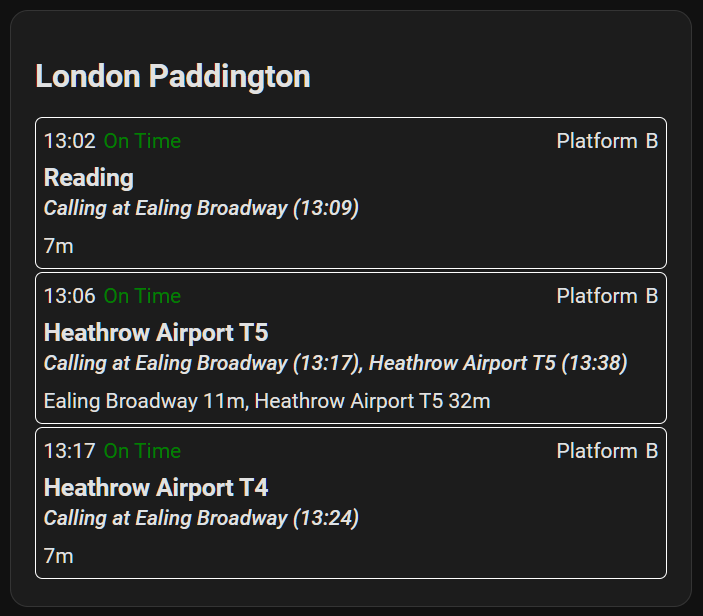

# Lovelace Nationalrail Status Card
A status card for [Home Assistant](https://github.com/home-assistant/home-assistant) Lovelace UI for showing the current status of trains running from a station.

The card works with entities from within the **sensor**  domain and is intended to be used with entities from the [National Rail API Integration](https://github.com/jfparis/homeassistant_nationalrail).



## Install

### HACS (recommended) 

This card is available in [HACS](https://hacs.xyz/) (Home Assistant Community Store).
<small>*HACS is a third party community store and is not included in Home Assistant out of the box.*</small>

### Manual install

1. Download and copy `nationalrail-status-card.js` from the [latest release](https://github.com/ChevronTango/ha-nationalrail-status-card/releases/latest) into your `config/www` directory.

2. Add the resource reference as decribed below.


### CLI install

1. Move into your `config/www` directory.

2. Grab `nationalrail-status-card.js`:

  ```
  $ wget https://github.com/ChevronTango/ha-nationalrail-status-card/releases/download/v0.0.1/nationalrail-status-card.js
  ```

3. Add the resource reference as decribed below.

### Add resource reference

If you configure Lovelace via YAML, add a reference to `nationalrail-status-card.js` inside your `configuration.yaml`:

  ```yaml
  resources:
    - url: /local/nationalrail-status-card.js?v=0.0.1
      type: module
  ```

Else, if you prefer the graphical editor, use the menu to add the resource:

1. Make sure, advanced mode is enabled in your user profile (click on your user name to get there)
2. Navigate to Configuration -> Lovelace Dashboards -> Resources Tab. Hit orange (+) icon
3. Enter URL `/local/nationalrail-status-card.js` and select type "JavaScript Module".
(Use `/hacsfiles/nationalrail-status-card/nationalrail-status-card.js` and select "JavaScript Module" for HACS install)
4. Restart Home Assistant.

## Using the card

We recommend looking at the [Example usage section](#example-usage) to understand the basics to configure this card.
(also) pay attention to the **required** options mentioned below.

### Options

#### Card options
| Name | Type | Default | Since | Description |
|------|:----:|:-------:|:-----:|-------------|
| type ***(required)*** | string |  | v0.0.1 | `custom:nationalrail-status-card`.
| entity ***(required)*** | string |  | v0.0.1 | The entity being monitored
| limit ***(optional)*** | number |  | v0.0.1 | The maximum number of trains to show at once. If absent then defaults to the API default.

## Development

1. Clone this repository into your `config/www` folder using git:

```
$ git clone https://github.com/ChevronTango/ha-nationalrail-status-card.git
```

2. Add a reference to the card in your `ui-lovelace.yaml`:

```yaml
resources:
  - url: /local/nationalrail-status-card/dist/nationalrail-status-card.js
    type: module
```

### Instructions

*Requires `nodejs` & `npm`.*

1. Move into the `nationalrail-status-card` repo, checkout the *dev* branch & install dependencies:
```console
$ cd nationalrail-status-card && git checkout dev && npm install
```

2. Make changes to the source code.

3. Build the source by running:
```console
$ npm run build
```

4. Refresh the browser to see changes.

    *Make sure cache is cleared or disabled.*

5. *(Optional)* Watch the source and automatically rebuild on save:
```console
$ npm run watch
```

*The new `nationalrail-status-card.js` will be build and ready inside `/dist`.*

Note that the `dev` branch is the most up-to-date and matches our beta releases.

Please refer to the [Contribution Guidelines](./CONTRIBUTING.md) if you're interested in contributing to the project. (And thanks for considering!)

## Getting errors?
Make sure you have `javascript_version: latest` in your `configuration.yaml` under `frontend:`.

Make sure you have the latest versions of `nationalrail-status-card.js` & `nationalrail-status-lib.js`.

If you have issues after updating the card, try clearing your browser cache.

If you have issues displaying the card in older browsers, try changing `type: module` to `type: js` at the card reference in `ui-lovelace.yaml`.

## License
This project is under the MIT license.